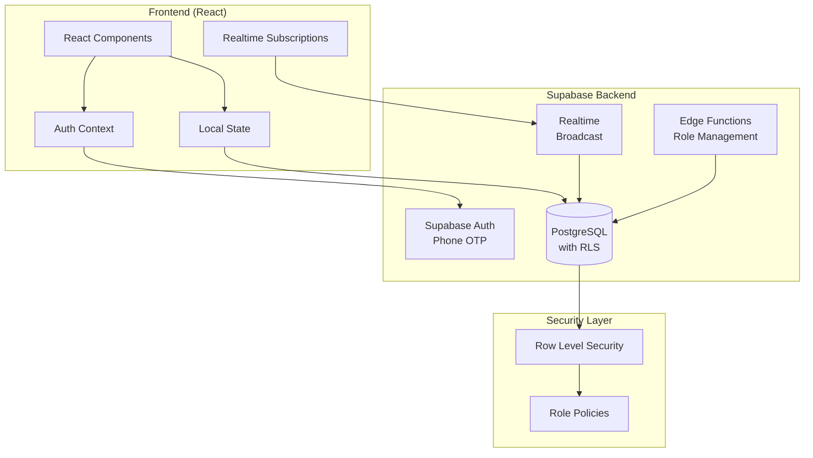
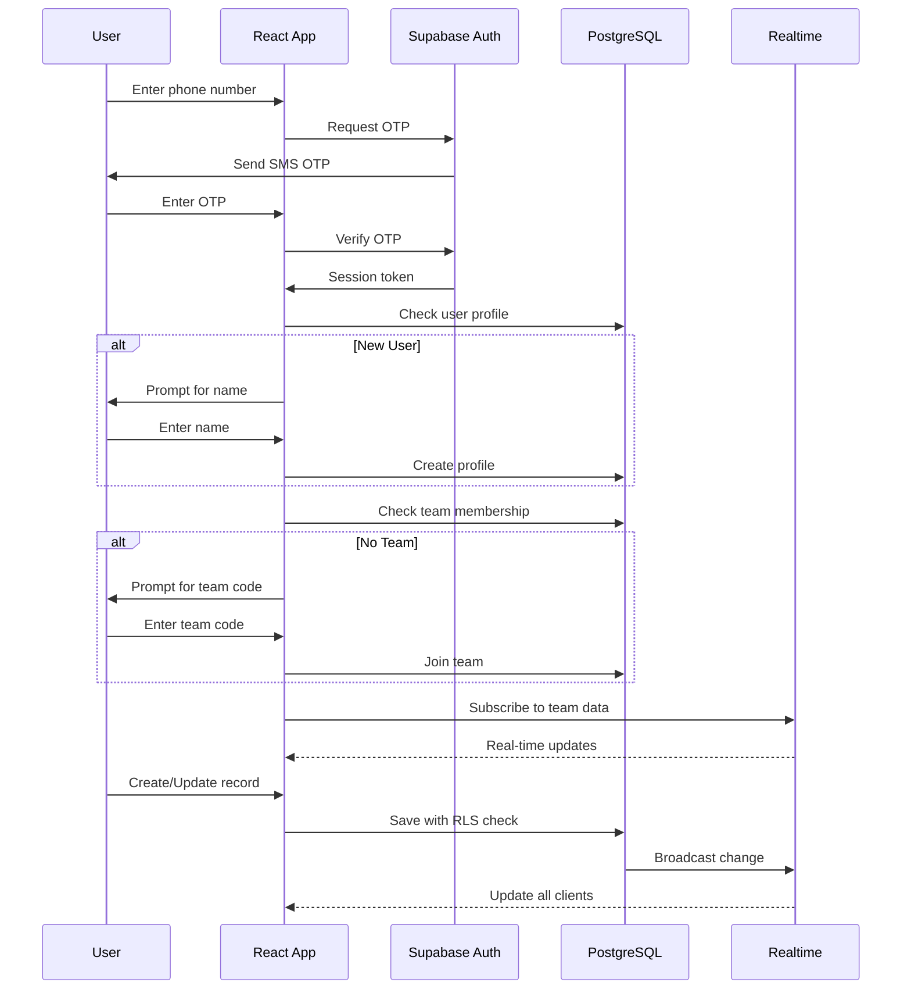

# Design Document: Supabase Backend

## Overview

This design document outlines the architecture and implementation details for migrating the Door-to-Door fundraising application from localStorage to a Supabase backend. The system will provide:

- Phone number OTP authentication via Supabase Auth
- Role-based access control (Dev, Owner, BDM, Team Leader, Team Member)
- Team code-based access system
- Real-time data synchronization using Supabase Realtime
- Row Level Security (RLS) for data protection
- Individual goal tracking and achievements
- Donation attribution to specific team members

The backend will use the existing Supabase project "doortodoor" (project ID: bglmbaebjmylpgcltjdn) in the ap-south-1 region.

## Architecture



### System Flow



## Components and Interfaces

### Authentication Service

```typescript
// services/supabase/authService.ts
interface AuthService {
  // Send OTP to phone number
  sendOTP(phone: string): Promise<{ success: boolean; error?: string }>;
  
  // Verify OTP and create session
  verifyOTP(phone: string, otp: string): Promise<{ 
    success: boolean; 
    user?: User; 
    error?: string 
  }>;
  
  // Get current session
  getSession(): Promise<Session | null>;
  
  // Sign out
  signOut(): Promise<void>;
  
  // Listen to auth state changes
  onAuthStateChange(callback: (event: AuthEvent, session: Session | null) => void): Subscription;
}
```

### User Profile Service

```typescript
// services/supabase/profileService.ts
interface ProfileService {
  // Get user profile
  getProfile(userId: string): Promise<UserProfile | null>;
  
  // Create or update profile
  upsertProfile(profile: Partial<UserProfile>): Promise<UserProfile>;
  
  // Get user's role
  getUserRole(userId: string): Promise<UserRole>;
  
  // Update user role (with permission check)
  updateUserRole(userId: string, newRole: UserRole, targetUserId: string): Promise<boolean>;
}

interface UserProfile {
  id: string;
  phone: string;
  name: string;
  email?: string;
  role: UserRole;
  created_at: string;
  updated_at: string;
}

type UserRole = 'dev' | 'owner' | 'bdm' | 'team_leader' | 'team_member';
```

### Team Service

```typescript
// services/supabase/teamService.ts
interface TeamService {
  // Create a new team (Owner/BDM only)
  createTeam(name: string, description?: string): Promise<Team>;
  
  // Generate unique team code
  generateTeamCode(): string;
  
  // Join team with code
  joinTeam(teamCode: string): Promise<{ success: boolean; team?: Team; error?: string }>;
  
  // Get user's teams
  getUserTeams(userId: string): Promise<TeamMembership[]>;
  
  // Get team members
  getTeamMembers(teamId: string): Promise<TeamMember[]>;
  
  // Remove member from team (Team Leader+)
  removeMember(teamId: string, userId: string): Promise<boolean>;
  
  // Update team details
  updateTeam(teamId: string, updates: Partial<Team>): Promise<Team>;
}

interface Team {
  id: string;
  name: string;
  description?: string;
  team_code: string;
  created_by: string;
  created_at: string;
}

interface TeamMembership {
  team_id: string;
  user_id: string;
  role: TeamRole;
  joined_at: string;
}

type TeamRole = 'leader' | 'member';
```

### Residential Data Service

```typescript
// services/supabase/residentialService.ts
interface ResidentialService {
  // Apartment CRUD
  createApartment(teamId: string, data: CreateApartmentInput): Promise<Apartment>;
  getApartments(teamId: string): Promise<Apartment[]>;
  updateApartment(apartmentId: string, updates: Partial<Apartment>): Promise<Apartment>;
  deleteApartment(apartmentId: string): Promise<boolean>;
  
  // Room CRUD
  updateRoom(roomId: string, updates: Partial<Room>): Promise<Room>;
  getRoomsByApartment(apartmentId: string): Promise<Room[]>;
  
  // Subscribe to real-time updates
  subscribeToApartments(teamId: string, callback: (payload: RealtimePayload) => void): Subscription;
  subscribeToRooms(apartmentId: string, callback: (payload: RealtimePayload) => void): Subscription;
}
```

### Business Data Service

```typescript
// services/supabase/businessService.ts
interface BusinessService {
  // Campaign CRUD
  createCampaign(teamId: string, data: CreateCampaignInput): Promise<BusinessCampaign>;
  getCampaigns(teamId: string): Promise<BusinessCampaign[]>;
  updateCampaign(campaignId: string, updates: Partial<BusinessCampaign>): Promise<BusinessCampaign>;
  deleteCampaign(campaignId: string): Promise<boolean>;
  
  // Business CRUD
  createBusiness(campaignId: string, data: CreateBusinessInput): Promise<Business>;
  updateBusiness(businessId: string, updates: Partial<Business>): Promise<Business>;
  deleteBusiness(businessId: string): Promise<boolean>;
  
  // Subscribe to real-time updates
  subscribeToCampaigns(teamId: string, callback: (payload: RealtimePayload) => void): Subscription;
  subscribeToBusinesses(campaignId: string, callback: (payload: RealtimePayload) => void): Subscription;
}
```

### Goals Service

```typescript
// services/supabase/goalsService.ts
interface GoalsService {
  // Get user's goal settings
  getGoalSettings(userId: string): Promise<GoalSettings>;
  
  // Update goal settings
  updateGoalSettings(userId: string, settings: Partial<GoalSettings>): Promise<GoalSettings>;
  
  // Get progress for date range
  getProgress(userId: string, startDate: string, endDate: string): Promise<GoalProgress[]>;
  
  // Update streak
  updateStreak(userId: string): Promise<StreakData>;
  
  // Get achievements
  getAchievements(userId: string): Promise<Achievement[]>;
  
  // Unlock achievement
  unlockAchievement(userId: string, achievementId: string): Promise<boolean>;
}
```

### Real-time Service

```typescript
// services/supabase/realtimeService.ts
interface RealtimeService {
  // Subscribe to team channel
  subscribeToTeam(teamId: string): RealtimeChannel;
  
  // Broadcast change to team
  broadcastChange(teamId: string, payload: ChangePayload): void;
  
  // Handle connection state
  onConnectionStateChange(callback: (state: ConnectionState) => void): void;
  
  // Queue offline changes
  queueOfflineChange(change: PendingChange): void;
  
  // Sync offline changes when reconnected
  syncOfflineChanges(): Promise<void>;
}
```

## Data Models

### Database Schema

```sql
-- Users table (extends Supabase auth.users)
CREATE TABLE public.profiles (
  id UUID PRIMARY KEY REFERENCES auth.users(id) ON DELETE CASCADE,
  phone TEXT NOT NULL,
  name TEXT NOT NULL,
  email TEXT,
  role user_role NOT NULL DEFAULT 'team_member',
  accessibility_settings JSONB DEFAULT '{}',
  created_at TIMESTAMPTZ DEFAULT NOW(),
  updated_at TIMESTAMPTZ DEFAULT NOW()
);

-- User roles enum
CREATE TYPE user_role AS ENUM ('dev', 'owner', 'bdm', 'team_leader', 'team_member');

-- Teams table
CREATE TABLE public.teams (
  id UUID PRIMARY KEY DEFAULT gen_random_uuid(),
  name TEXT NOT NULL,
  description TEXT,
  team_code TEXT UNIQUE NOT NULL,
  created_by UUID REFERENCES public.profiles(id),
  created_at TIMESTAMPTZ DEFAULT NOW(),
  updated_at TIMESTAMPTZ DEFAULT NOW()
);

-- Team memberships (many-to-many)
CREATE TABLE public.team_memberships (
  id UUID PRIMARY KEY DEFAULT gen_random_uuid(),
  team_id UUID REFERENCES public.teams(id) ON DELETE CASCADE,
  user_id UUID REFERENCES public.profiles(id) ON DELETE CASCADE,
  team_role team_role NOT NULL DEFAULT 'member',
  joined_at TIMESTAMPTZ DEFAULT NOW(),
  UNIQUE(team_id, user_id)
);

CREATE TYPE team_role AS ENUM ('leader', 'member');

-- Apartments (Residential Campaigns)
CREATE TABLE public.apartments (
  id UUID PRIMARY KEY DEFAULT gen_random_uuid(),
  team_id UUID REFERENCES public.teams(id) ON DELETE CASCADE,
  name TEXT NOT NULL,
  floors INTEGER NOT NULL,
  units_per_floor INTEGER NOT NULL,
  target_amount DECIMAL(12,2) DEFAULT 0,
  created_at TIMESTAMPTZ DEFAULT NOW(),
  updated_at TIMESTAMPTZ DEFAULT NOW()
);

-- Rooms
CREATE TABLE public.rooms (
  id UUID PRIMARY KEY DEFAULT gen_random_uuid(),
  apartment_id UUID REFERENCES public.apartments(id) ON DELETE CASCADE,
  floor INTEGER NOT NULL,
  room_number INTEGER NOT NULL,
  status room_status NOT NULL DEFAULT 'unvisited',
  visitor_name TEXT,
  remark TEXT,
  note TEXT,
  -- Donor information
  donor_phone TEXT,
  donor_email TEXT,
  donor_address TEXT,
  donor_pan TEXT,
  amount_donated DECIMAL(12,2) DEFAULT 0,
  supports_count INTEGER DEFAULT 0,
  payment_mode payment_mode,
  receipt_number TEXT,
  -- Attribution
  collected_by UUID REFERENCES public.profiles(id),
  entered_by UUID REFERENCES public.profiles(id),
  updated_at TIMESTAMPTZ,
  created_at TIMESTAMPTZ DEFAULT NOW()
);

CREATE TYPE room_status AS ENUM ('unvisited', 'donated', 'not_interested', 'callback', 'other');
CREATE TYPE payment_mode AS ENUM ('cash', 'upi', 'card', 'cheque', 'online');

-- Business Campaigns
CREATE TABLE public.business_campaigns (
  id UUID PRIMARY KEY DEFAULT gen_random_uuid(),
  team_id UUID REFERENCES public.teams(id) ON DELETE CASCADE,
  name TEXT NOT NULL,
  area TEXT,
  target_amount DECIMAL(12,2) DEFAULT 0,
  created_at TIMESTAMPTZ DEFAULT NOW(),
  updated_at TIMESTAMPTZ DEFAULT NOW()
);

-- Businesses
CREATE TABLE public.businesses (
  id UUID PRIMARY KEY DEFAULT gen_random_uuid(),
  campaign_id UUID REFERENCES public.business_campaigns(id) ON DELETE CASCADE,
  name TEXT NOT NULL,
  contact_person TEXT,
  phone TEXT,
  email TEXT,
  address TEXT,
  category business_category NOT NULL DEFAULT 'other',
  status business_status NOT NULL DEFAULT 'unvisited',
  note TEXT,
  amount_donated DECIMAL(12,2) DEFAULT 0,
  amount_pledged DECIMAL(12,2) DEFAULT 0,
  next_follow_up TIMESTAMPTZ,
  -- Attribution
  collected_by UUID REFERENCES public.profiles(id),
  entered_by UUID REFERENCES public.profiles(id),
  updated_at TIMESTAMPTZ,
  created_at TIMESTAMPTZ DEFAULT NOW()
);

CREATE TYPE business_category AS ENUM ('corporate', 'retail', 'restaurant', 'clinic', 'office', 'factory', 'other');
CREATE TYPE business_status AS ENUM ('unvisited', 'donated', 'not_interested', 'callback', 'meeting_scheduled', 'follow_up');

-- Goal Settings (per user)
CREATE TABLE public.goal_settings (
  id UUID PRIMARY KEY DEFAULT gen_random_uuid(),
  user_id UUID REFERENCES public.profiles(id) ON DELETE CASCADE UNIQUE,
  daily_presentations INTEGER DEFAULT 20,
  daily_forms INTEGER DEFAULT 5,
  daily_supports INTEGER DEFAULT 3,
  weekly_presentations INTEGER DEFAULT 100,
  weekly_forms INTEGER DEFAULT 25,
  weekly_supports INTEGER DEFAULT 15,
  current_streak INTEGER DEFAULT 0,
  longest_streak INTEGER DEFAULT 0,
  last_active_date DATE,
  created_at TIMESTAMPTZ DEFAULT NOW(),
  updated_at TIMESTAMPTZ DEFAULT NOW()
);

-- Achievements (per user)
CREATE TABLE public.user_achievements (
  id UUID PRIMARY KEY DEFAULT gen_random_uuid(),
  user_id UUID REFERENCES public.profiles(id) ON DELETE CASCADE,
  achievement_id TEXT NOT NULL,
  unlocked_at TIMESTAMPTZ DEFAULT NOW(),
  UNIQUE(user_id, achievement_id)
);

-- Role change audit log
CREATE TABLE public.role_audit_log (
  id UUID PRIMARY KEY DEFAULT gen_random_uuid(),
  changed_by UUID REFERENCES public.profiles(id),
  target_user UUID REFERENCES public.profiles(id),
  old_role user_role,
  new_role user_role,
  changed_at TIMESTAMPTZ DEFAULT NOW()
);

-- Indexes for performance
CREATE INDEX idx_team_memberships_user ON public.team_memberships(user_id);
CREATE INDEX idx_team_memberships_team ON public.team_memberships(team_id);
CREATE INDEX idx_apartments_team ON public.apartments(team_id);
CREATE INDEX idx_rooms_apartment ON public.rooms(apartment_id);
CREATE INDEX idx_rooms_collected_by ON public.rooms(collected_by);
CREATE INDEX idx_business_campaigns_team ON public.business_campaigns(team_id);
CREATE INDEX idx_businesses_campaign ON public.businesses(campaign_id);
CREATE INDEX idx_businesses_collected_by ON public.businesses(collected_by);
CREATE INDEX idx_teams_code ON public.teams(team_code);
```

### Row Level Security Policies

```sql
-- Enable RLS on all tables
ALTER TABLE public.profiles ENABLE ROW LEVEL SECURITY;
ALTER TABLE public.teams ENABLE ROW LEVEL SECURITY;
ALTER TABLE public.team_memberships ENABLE ROW LEVEL SECURITY;
ALTER TABLE public.apartments ENABLE ROW LEVEL SECURITY;
ALTER TABLE public.rooms ENABLE ROW LEVEL SECURITY;
ALTER TABLE public.business_campaigns ENABLE ROW LEVEL SECURITY;
ALTER TABLE public.businesses ENABLE ROW LEVEL SECURITY;
ALTER TABLE public.goal_settings ENABLE ROW LEVEL SECURITY;
ALTER TABLE public.user_achievements ENABLE ROW LEVEL SECURITY;

-- Helper function to check team membership
CREATE OR REPLACE FUNCTION public.is_team_member(team_uuid UUID)
RETURNS BOOLEAN AS $$
BEGIN
  RETURN EXISTS (
    SELECT 1 FROM public.team_memberships
    WHERE team_id = team_uuid AND user_id = auth.uid()
  );
END;
$$ LANGUAGE plpgsql SECURITY DEFINER;

-- Helper function to check user role
CREATE OR REPLACE FUNCTION public.get_user_role()
RETURNS user_role AS $$
BEGIN
  RETURN (SELECT role FROM public.profiles WHERE id = auth.uid());
END;
$$ LANGUAGE plpgsql SECURITY DEFINER;

-- Helper function to check if user is owner or bdm
CREATE OR REPLACE FUNCTION public.is_admin()
RETURNS BOOLEAN AS $$
BEGIN
  RETURN (SELECT role IN ('dev', 'owner', 'bdm') FROM public.profiles WHERE id = auth.uid());
END;
$$ LANGUAGE plpgsql SECURITY DEFINER;

-- Profiles policies
CREATE POLICY "Users can view own profile" ON public.profiles
  FOR SELECT USING (auth.uid() = id);

CREATE POLICY "Users can update own profile" ON public.profiles
  FOR UPDATE USING (auth.uid() = id)
  WITH CHECK (auth.uid() = id AND role = (SELECT role FROM public.profiles WHERE id = auth.uid()));

CREATE POLICY "Team members can view each other" ON public.profiles
  FOR SELECT USING (
    EXISTS (
      SELECT 1 FROM public.team_memberships tm1
      JOIN public.team_memberships tm2 ON tm1.team_id = tm2.team_id
      WHERE tm1.user_id = auth.uid() AND tm2.user_id = profiles.id
    )
  );

-- Teams policies
CREATE POLICY "Team members can view their teams" ON public.teams
  FOR SELECT USING (public.is_team_member(id) OR public.is_admin());

CREATE POLICY "Admins can create teams" ON public.teams
  FOR INSERT WITH CHECK (public.is_admin());

CREATE POLICY "Team leaders and admins can update teams" ON public.teams
  FOR UPDATE USING (
    public.is_admin() OR
    EXISTS (
      SELECT 1 FROM public.team_memberships
      WHERE team_id = teams.id AND user_id = auth.uid() AND team_role = 'leader'
    )
  );

-- Team memberships policies
CREATE POLICY "Users can view team memberships" ON public.team_memberships
  FOR SELECT USING (public.is_team_member(team_id) OR public.is_admin());

CREATE POLICY "Users can join teams" ON public.team_memberships
  FOR INSERT WITH CHECK (user_id = auth.uid());

-- Apartments policies
CREATE POLICY "Team members can view apartments" ON public.apartments
  FOR SELECT USING (public.is_team_member(team_id));

CREATE POLICY "Team members can create apartments" ON public.apartments
  FOR INSERT WITH CHECK (public.is_team_member(team_id));

CREATE POLICY "Team members can update apartments" ON public.apartments
  FOR UPDATE USING (public.is_team_member(team_id));

CREATE POLICY "Team leaders and admins can delete apartments" ON public.apartments
  FOR DELETE USING (
    public.is_admin() OR
    EXISTS (
      SELECT 1 FROM public.team_memberships
      WHERE team_id = apartments.team_id AND user_id = auth.uid() AND team_role = 'leader'
    )
  );

-- Rooms policies
CREATE POLICY "Team members can view rooms" ON public.rooms
  FOR SELECT USING (
    EXISTS (
      SELECT 1 FROM public.apartments a
      WHERE a.id = rooms.apartment_id AND public.is_team_member(a.team_id)
    )
  );

CREATE POLICY "Team members can update rooms" ON public.rooms
  FOR UPDATE USING (
    EXISTS (
      SELECT 1 FROM public.apartments a
      WHERE a.id = rooms.apartment_id AND public.is_team_member(a.team_id)
    )
  );

-- Business campaigns policies (similar to apartments)
CREATE POLICY "Team members can view campaigns" ON public.business_campaigns
  FOR SELECT USING (public.is_team_member(team_id));

CREATE POLICY "Team members can create campaigns" ON public.business_campaigns
  FOR INSERT WITH CHECK (public.is_team_member(team_id));

CREATE POLICY "Team members can update campaigns" ON public.business_campaigns
  FOR UPDATE USING (public.is_team_member(team_id));

-- Businesses policies (similar to rooms)
CREATE POLICY "Team members can view businesses" ON public.businesses
  FOR SELECT USING (
    EXISTS (
      SELECT 1 FROM public.business_campaigns bc
      WHERE bc.id = businesses.campaign_id AND public.is_team_member(bc.team_id)
    )
  );

CREATE POLICY "Team members can manage businesses" ON public.businesses
  FOR ALL USING (
    EXISTS (
      SELECT 1 FROM public.business_campaigns bc
      WHERE bc.id = businesses.campaign_id AND public.is_team_member(bc.team_id)
    )
  );

-- Goal settings policies
CREATE POLICY "Users can manage own goals" ON public.goal_settings
  FOR ALL USING (user_id = auth.uid());

-- Achievements policies
CREATE POLICY "Users can manage own achievements" ON public.user_achievements
  FOR ALL USING (user_id = auth.uid());
```

## Correctness Properties

*A property is a characteristic or behavior that should hold true across all valid executions of a system-essentially, a formal statement about what the system should do. Properties serve as the bridge between human-readable specifications and machine-verifiable correctness guarantees.*


Based on the prework analysis, the following correctness properties have been identified:

### Property 1: OTP Verification Correctness
*For any* phone number and OTP combination, if the OTP is valid and not expired, verification SHALL succeed and create a session; if the OTP is invalid or expired, verification SHALL fail and return an error.
**Validates: Requirements 1.2, 1.3, 1.4**

### Property 2: Team Code Generation Uniqueness
*For any* team creation by an authorized user (Owner or BDM), the generated team code SHALL be exactly 8 alphanumeric characters and SHALL be unique across all existing teams.
**Validates: Requirements 2.1, 2.5**

### Property 3: Team Code Validation
*For any* team code input, if the code exists in the database, joining SHALL succeed and add the user as a Team Member; if the code does not exist, joining SHALL fail with an error.
**Validates: Requirements 3.1, 3.2**

### Property 4: Role Permission Hierarchy
*For any* role assignment operation, the assigning user's role SHALL determine which roles they can assign:
- Dev: Can assign any role including Owner (max 3 owners)
- Owner: Can assign BDM, Team Leader, Team Member (not Owner)
- BDM: Can assign Team Leader, Team Member (not Owner, BDM)
- Team Leader: Can assign Team Member only within their team
- Team Member: Cannot assign any roles
**Validates: Requirements 4.1, 4.2, 5.3, 5.4, 6.2, 6.3, 7.2, 7.3**

### Property 5: Row Level Security Enforcement
*For any* database query, the results SHALL only include records that belong to teams where the querying user is a member, unless the user has Owner or BDM role.
**Validates: Requirements 10.1, 10.2**

### Property 6: Visit Data Persistence Round-Trip
*For any* residential room or business visit record, saving the record and then retrieving it SHALL return all fields with identical values, including donor information, amounts, and attribution.
**Validates: Requirements 8.1, 8.2, 8.3, 13.1, 13.2, 14.1, 14.2**

### Property 7: Donation Attribution Correctness
*For any* donation record with a specified collecting member, the donation SHALL be attributed to the collecting member (not the data entry member) when calculating individual statistics and goal progress.
**Validates: Requirements 22.4, 22.5, 22.6**

### Property 8: Streak Calculation Correctness
*For any* user with activity history, the current streak SHALL equal the number of consecutive days with activity ending on the last active date; if the last active date is not yesterday or today, the current streak SHALL be zero.
**Validates: Requirements 15.3, 15.4**

### Property 9: Achievement Unlock Correctness
*For any* user reaching an achievement milestone, the achievement SHALL be unlocked and the unlock timestamp SHALL be recorded; achievements SHALL only count the user's individual statistics.
**Validates: Requirements 16.1, 16.4, 16.5**

### Property 10: Team Member Statistics Aggregation
*For any* team, the aggregated statistics SHALL equal the sum of individual member contributions, where each donation is counted exactly once under the collecting member.
**Validates: Requirements 11.3, 20.3**

### Property 11: Profile Data Persistence
*For any* user profile update, saving and retrieving the profile SHALL return the updated name and email (if provided) with the phone number unchanged from authentication.
**Validates: Requirements 19.2, 19.3, 19.4**

### Property 12: Export Data Scope
*For any* data export operation, the exported data SHALL only include records from teams where the user has membership, respecting role-based access permissions.
**Validates: Requirements 18.1, 18.5**

### Property 13: Team Code QR Round-Trip
*For any* team code, generating a QR code and scanning it SHALL extract the same team code that was encoded.
**Validates: Requirements 21.3, 21.4**

### Property 14: Supports Count Calculation
*For any* donation amount, the supports count SHALL equal the floor of (amount / 1200), ensuring consistent calculation across all donations.
**Validates: Requirements 13.5**

### Property 15: Accessibility Settings Persistence
*For any* accessibility settings change, saving and retrieving the settings SHALL return identical values for high contrast mode, touch target size, and font size.
**Validates: Requirements 17.4, 17.5**

## Error Handling

### Authentication Errors
| Error Code | Description | User Message |
|------------|-------------|--------------|
| AUTH_INVALID_PHONE | Phone number format invalid | Please enter a valid phone number |
| AUTH_OTP_EXPIRED | OTP has expired | Your code has expired. Please request a new one |
| AUTH_OTP_INVALID | OTP does not match | Invalid code. Please try again |
| AUTH_RATE_LIMITED | Too many OTP requests | Too many attempts. Please wait before trying again |
| AUTH_SESSION_EXPIRED | Session has expired | Your session has expired. Please sign in again |

### Team Errors
| Error Code | Description | User Message |
|------------|-------------|--------------|
| TEAM_CODE_INVALID | Team code not found | Invalid team code. Please check and try again |
| TEAM_ALREADY_MEMBER | User already in team | You are already a member of this team |
| TEAM_PERMISSION_DENIED | Insufficient permissions | You don't have permission to perform this action |
| TEAM_MAX_OWNERS | Maximum owners reached | Cannot add more owners. Maximum of 3 owners allowed |

### Data Errors
| Error Code | Description | User Message |
|------------|-------------|--------------|
| DATA_NOT_FOUND | Record not found | The requested record was not found |
| DATA_CONFLICT | Concurrent edit conflict | This record was modified by another user. Please refresh |
| DATA_VALIDATION | Validation failed | Please check your input and try again |
| DATA_RLS_DENIED | RLS policy denied access | You don't have access to this data |

### Offline/Sync Errors
| Error Code | Description | User Message |
|------------|-------------|--------------|
| SYNC_OFFLINE | No network connection | You're offline. Changes will sync when connected |
| SYNC_CONFLICT | Sync conflict detected | Conflict detected. Most recent change applied |
| SYNC_FAILED | Sync operation failed | Failed to sync. Retrying... |

## Testing Strategy

### Property-Based Testing Library
The project will use **fast-check** for property-based testing in TypeScript/JavaScript.

### Unit Tests
Unit tests will cover:
- Authentication flow (OTP send, verify, session management)
- Team code generation and validation
- Role permission checks
- Data validation functions
- Streak calculation logic
- Achievement milestone detection

### Property-Based Tests
Each correctness property will have a corresponding property-based test:

1. **OTP Verification Property Test**: Generate random valid/invalid OTPs and verify correct behavior
2. **Team Code Property Test**: Generate many team codes and verify uniqueness and format
3. **Role Permission Property Test**: Generate role combinations and verify permission matrix
4. **RLS Property Test**: Generate queries with different user contexts and verify filtering
5. **Data Round-Trip Property Test**: Generate random visit records and verify persistence
6. **Attribution Property Test**: Generate donations with different collectors and verify statistics
7. **Streak Property Test**: Generate activity histories and verify streak calculation
8. **Achievement Property Test**: Generate progress data and verify unlock logic

### Integration Tests
- Supabase Auth integration
- Real-time subscription handling
- Offline sync queue
- Data migration from localStorage

### Test Configuration
- Property tests: Minimum 100 iterations per property
- Each property test tagged with: `**Feature: supabase-backend, Property {number}: {property_text}**`
