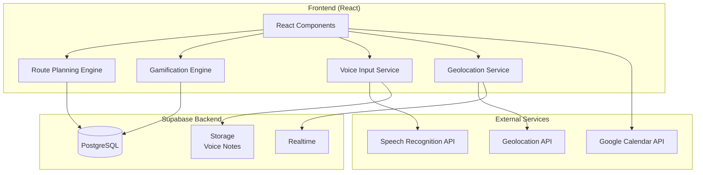
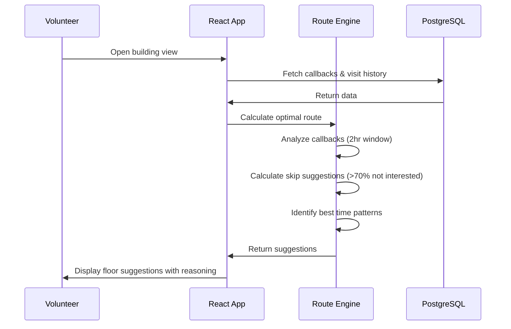
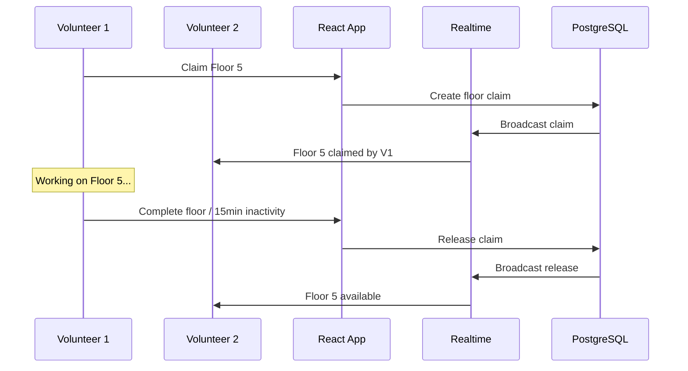

# Design Document: Volunteer Engagement System

## Overview

This design document outlines the architecture and implementation details for advanced volunteer engagement features in the Door-to-Door fundraising application. The system will provide:

- Smart route planning with optimal floor suggestions and skip logic
- Real-time field coordination with volunteer tracking and floor claiming
- Campaign templates for rapid setup
- Enhanced mobile experience with voice notes and quick actions
- Gamification features including challenges, competitions, and milestones

The features integrate with the existing Supabase backend and extend the current team and campaign management capabilities.

## Architecture




### System Flow - Route Planning



### System Flow - Floor Claiming



## Components and Interfaces

### Route Planning Service

```typescript
// services/routePlanningService.ts
interface RoutePlanningService {
  // Get optimal starting floor based on callbacks
  getOptimalStartFloor(apartmentId: string): Promise<FloorSuggestion>;
  
  // Get floors to skip based on success rates
  getSkipSuggestions(apartmentId: string): Promise<SkipSuggestion[]>;
  
  // Get best time to visit insights
  getBestTimeInsights(apartmentId: string): Promise<TimeInsight[]>;
  
  // Get nearby campaigns sorted by distance
  getNearbyCampaigns(currentLocation: Coordinates, teamId: string): Promise<NearbyCampaign[]>;
  
  // Calculate distance between two points
  calculateDistance(from: Coordinates, to: Coordinates): number;
}

interface FloorSuggestion {
  floor: number;
  reason: string;
  callbackCount: number;
  urgentCallbacks: Callback[];
}

interface SkipSuggestion {
  floor: number;
  notInterestedRate: number;
  totalVisits: number;
  shouldSkip: boolean;
}

interface TimeInsight {
  hourRange: string; // e.g., "10:00-12:00"
  successRate: number;
  totalVisits: number;
  isPeakHour: boolean;
}

interface Coordinates {
  latitude: number;
  longitude: number;
}
```

### Floor Claiming Service

```typescript
// services/floorClaimService.ts
interface FloorClaimService {
  // Claim a floor for the current user
  claimFloor(apartmentId: string, floor: number): Promise<FloorClaim>;
  
  // Release a floor claim
  releaseFloor(claimId: string): Promise<void>;
  
  // Get all claims for an apartment
  getFloorClaims(apartmentId: string): Promise<FloorClaim[]>;
  
  // Check if floor is claimed by another user
  isFloorClaimed(apartmentId: string, floor: number): Promise<ClaimStatus>;
  
  // Auto-release stale claims (called by background job)
  releaseStaleClaimsForApartment(apartmentId: string): Promise<number>;
}

interface FloorClaim {
  id: string;
  apartmentId: string;
  floor: number;
  userId: string;
  userName: string;
  claimedAt: string;
  lastActivityAt: string;
}

interface ClaimStatus {
  isClaimed: boolean;
  claimedBy?: string;
  claimedByName?: string;
  claimedAt?: string;
}
```


### Help Request Service

```typescript
// services/helpRequestService.ts
interface HelpRequestService {
  // Send help request to team leader
  sendHelpRequest(message: string, location?: Coordinates): Promise<HelpRequest>;
  
  // Acknowledge a help request (team leader)
  acknowledgeRequest(requestId: string): Promise<void>;
  
  // Resolve a help request
  resolveRequest(requestId: string, resolution?: string): Promise<void>;
  
  // Get pending help requests for team
  getPendingRequests(teamId: string): Promise<HelpRequest[]>;
  
  // Subscribe to help requests
  subscribeToHelpRequests(teamId: string, callback: (request: HelpRequest) => void): Subscription;
}

interface HelpRequest {
  id: string;
  volunteerId: string;
  volunteerName: string;
  teamId: string;
  message: string;
  location?: Coordinates;
  buildingName?: string;
  floor?: number;
  status: 'pending' | 'acknowledged' | 'resolved';
  createdAt: string;
  acknowledgedAt?: string;
  resolvedAt?: string;
  resolutionTime?: number; // milliseconds
}
```

### Activity Feed Service

```typescript
// services/activityFeedService.ts
interface ActivityFeedService {
  // Add activity to feed
  logActivity(activity: ActivityInput): Promise<ActivityEntry>;
  
  // Get feed entries with pagination
  getFeed(teamId: string, options: FeedOptions): Promise<PaginatedFeed>;
  
  // Subscribe to live feed updates
  subscribeToFeed(teamId: string, callback: (entry: ActivityEntry) => void): Subscription;
}

interface ActivityEntry {
  id: string;
  teamId: string;
  volunteerId: string;
  volunteerName: string;
  actionType: 'visit' | 'donation' | 'callback_scheduled' | 'floor_claimed' | 'help_request';
  buildingName: string;
  floor?: number;
  roomNumber?: number;
  amount?: number;
  timestamp: string;
  isCelebration: boolean; // true for donations
}

interface FeedOptions {
  limit?: number;
  offset?: number;
  volunteerId?: string;
  actionType?: string;
  buildingId?: string;
}
```

### Campaign Template Service

```typescript
// services/campaignTemplateService.ts
interface CampaignTemplateService {
  // Get available building presets
  getBuildingPresets(): BuildingPreset[];
  
  // Apply preset to create campaign
  applyPreset(presetId: string, name: string, teamId: string): Promise<Apartment>;
  
  // Clone existing campaign
  cloneCampaign(campaignId: string, newName: string): Promise<Apartment>;
  
  // Get area templates
  getAreaTemplates(): AreaTemplate[];
  
  // Apply area template
  applyAreaTemplate(templateId: string, teamId: string): Promise<Apartment[]>;
  
  // Save custom preset
  saveCustomPreset(preset: CustomPresetInput): Promise<BuildingPreset>;
  
  // Import from CSV
  importFromCSV(file: File, teamId: string): Promise<ImportResult>;
  
  // Get CSV template
  getCSVTemplate(): string;
}

interface BuildingPreset {
  id: string;
  name: string;
  floors: number;
  unitsPerFloor: number;
  isCustom: boolean;
}

interface AreaTemplate {
  id: string;
  name: string;
  buildings: BuildingPreset[];
  totalUnits: number;
}

interface ImportResult {
  success: boolean;
  campaignsCreated: number;
  errors: ImportError[];
}

interface ImportError {
  row: number;
  column: string;
  message: string;
}
```


### Voice Notes Service

```typescript
// services/voiceNotesService.ts
interface VoiceNotesService {
  // Start recording
  startRecording(): Promise<void>;
  
  // Stop recording and get audio blob
  stopRecording(): Promise<Blob>;
  
  // Transcribe audio to text
  transcribeAudio(audioBlob: Blob): Promise<TranscriptionResult>;
  
  // Save voice note with transcription
  saveVoiceNote(roomId: string, audioBlob: Blob, transcription: string): Promise<VoiceNote>;
  
  // Get voice notes for room
  getVoiceNotes(roomId: string): Promise<VoiceNote[]>;
}

interface VoiceNote {
  id: string;
  roomId: string;
  audioUrl: string;
  transcription: string;
  createdAt: string;
  createdBy: string;
}

interface TranscriptionResult {
  success: boolean;
  text?: string;
  confidence?: number;
  error?: string;
}
```

### Undo Service

```typescript
// services/undoService.ts
interface UndoService {
  // Record an action for potential undo
  recordAction(action: UndoableAction): void;
  
  // Get last undoable action within time window
  getLastUndoableAction(): UndoableAction | null;
  
  // Execute undo
  executeUndo(actionId: string): Promise<void>;
  
  // Clear undo history
  clearHistory(): void;
  
  // Check if shake-to-undo is enabled
  isShakeToUndoEnabled(): boolean;
  
  // Toggle shake-to-undo setting
  setShakeToUndoEnabled(enabled: boolean): Promise<void>;
}

interface UndoableAction {
  id: string;
  type: 'status_change';
  entityType: 'room' | 'business';
  entityId: string;
  previousState: any;
  currentState: any;
  timestamp: number;
  expiresAt: number; // timestamp + 10 seconds
}
```

### Gamification Service

```typescript
// services/gamificationService.ts
interface GamificationService {
  // Generate daily challenges for user
  generateDailyChallenges(userId: string): Promise<Challenge[]>;
  
  // Get current challenges
  getCurrentChallenges(userId: string): Promise<Challenge[]>;
  
  // Update challenge progress
  updateChallengeProgress(userId: string, activityType: string, count: number): Promise<ChallengeUpdate[]>;
  
  // Complete challenge and award XP
  completeChallenge(userId: string, challengeId: string): Promise<XPReward>;
  
  // Get team leaderboard
  getTeamLeaderboard(weekStart: string): Promise<TeamRanking[]>;
  
  // Check for milestone achievements
  checkMilestones(userId: string): Promise<Milestone[]>;
  
  // Record milestone achievement
  recordMilestone(userId: string, milestoneType: string, count: number): Promise<void>;
  
  // Get user XP and level
  getUserXP(userId: string): Promise<UserXP>;
}

interface Challenge {
  id: string;
  title: string;
  description: string;
  type: 'visits' | 'donations' | 'forms' | 'callbacks';
  target: number;
  current: number;
  xpReward: number;
  expiresAt: string;
  isCompleted: boolean;
}

interface TeamRanking {
  teamId: string;
  teamName: string;
  score: number;
  donations: number;
  visits: number;
  conversionRate: number;
  rank: number;
  isUserTeam: boolean;
}

interface Milestone {
  type: 'donation_count';
  threshold: number; // 10, 50, 100, 500
  achieved: boolean;
  achievedAt?: string;
}

interface UserXP {
  totalXP: number;
  level: number;
  xpToNextLevel: number;
}
```


### Volunteer Profile Service

```typescript
// services/volunteerProfileService.ts
interface VolunteerProfileService {
  // Get volunteer profile with statistics
  getProfile(userId: string): Promise<VolunteerProfile>;
  
  // Get public profile (for other team members)
  getPublicProfile(userId: string, viewerId: string): Promise<PublicProfile>;
  
  // Update profile visibility settings
  updateVisibility(userId: string, settings: VisibilitySettings): Promise<void>;
  
  // Get activity history
  getActivityHistory(userId: string, days: number): Promise<ActivityHistory[]>;
  
  // Calculate conversion rate
  calculateConversionRate(userId: string): Promise<number>;
}

interface VolunteerProfile {
  userId: string;
  name: string;
  totalDonations: number;
  totalVisits: number;
  conversionRate: number;
  totalAmount: number;
  badges: Badge[];
  milestones: Milestone[];
  joinedAt: string;
  visibility: VisibilitySettings;
}

interface PublicProfile {
  userId: string;
  name: string;
  totalDonations?: number;
  totalVisits?: number;
  conversionRate?: number;
  badges: Badge[];
  milestones: Milestone[];
}

interface VisibilitySettings {
  showDonations: boolean;
  showVisits: boolean;
  showConversionRate: boolean;
  showAmount: boolean;
}
```

### Calendar Sync Service

```typescript
// services/calendarSyncService.ts
interface CalendarSyncService {
  // Check if calendar sync is enabled
  isCalendarSyncEnabled(): Promise<boolean>;
  
  // Enable calendar sync (request permissions)
  enableCalendarSync(): Promise<boolean>;
  
  // Add callback to calendar
  addCallbackToCalendar(callback: CallbackEvent): Promise<CalendarEventId>;
  
  // Update calendar event
  updateCalendarEvent(eventId: CalendarEventId, callback: CallbackEvent): Promise<void>;
  
  // Remove calendar event
  removeCalendarEvent(eventId: CalendarEventId): Promise<void>;
  
  // Sync all pending callbacks
  syncAllCallbacks(userId: string): Promise<SyncResult>;
}

interface CallbackEvent {
  roomId: string;
  buildingName: string;
  floor: number;
  roomNumber: number;
  scheduledTime: string;
  notes?: string;
}

interface SyncResult {
  added: number;
  updated: number;
  removed: number;
  errors: string[];
}
```

### Battery Saver Service

```typescript
// services/batterySaverService.ts
interface BatterySaverService {
  // Get current battery level
  getBatteryLevel(): Promise<number>;
  
  // Check if battery saver is enabled
  isBatterySaverEnabled(): boolean;
  
  // Enable battery saver mode
  enableBatterySaver(): void;
  
  // Disable battery saver mode
  disableBatterySaver(): void;
  
  // Get current sync interval
  getSyncInterval(): number;
  
  // Get current location update interval
  getLocationUpdateInterval(): number;
  
  // Subscribe to battery level changes
  onBatteryLevelChange(callback: (level: number) => void): Subscription;
}

// Battery saver configuration
const BATTERY_SAVER_CONFIG = {
  lowBatteryThreshold: 20,
  recoveryThreshold: 30,
  normalSyncInterval: 1000, // 1 second
  batterySaverSyncInterval: 300000, // 5 minutes
  normalLocationInterval: 10000, // 10 seconds
  batterySaverLocationInterval: 60000, // 1 minute
};
```

## Data Models

### Database Schema Extensions

```sql
-- Floor claims table
CREATE TABLE public.floor_claims (
  id UUID PRIMARY KEY DEFAULT gen_random_uuid(),
  apartment_id UUID REFERENCES public.apartments(id) ON DELETE CASCADE,
  floor INTEGER NOT NULL,
  user_id UUID REFERENCES public.profiles(id) ON DELETE CASCADE,
  claimed_at TIMESTAMPTZ DEFAULT NOW(),
  last_activity_at TIMESTAMPTZ DEFAULT NOW(),
  UNIQUE(apartment_id, floor)
);

-- Help requests table
CREATE TABLE public.help_requests (
  id UUID PRIMARY KEY DEFAULT gen_random_uuid(),
  team_id UUID REFERENCES public.teams(id) ON DELETE CASCADE,
  volunteer_id UUID REFERENCES public.profiles(id) ON DELETE CASCADE,
  message TEXT NOT NULL,
  latitude DECIMAL(10, 8),
  longitude DECIMAL(11, 8),
  building_name TEXT,
  floor INTEGER,
  status help_request_status NOT NULL DEFAULT 'pending',
  created_at TIMESTAMPTZ DEFAULT NOW(),
  acknowledged_at TIMESTAMPTZ,
  resolved_at TIMESTAMPTZ
);

CREATE TYPE help_request_status AS ENUM ('pending', 'acknowledged', 'resolved');


-- Activity feed table
CREATE TABLE public.activity_feed (
  id UUID PRIMARY KEY DEFAULT gen_random_uuid(),
  team_id UUID REFERENCES public.teams(id) ON DELETE CASCADE,
  volunteer_id UUID REFERENCES public.profiles(id) ON DELETE CASCADE,
  action_type activity_type NOT NULL,
  building_id UUID REFERENCES public.apartments(id),
  building_name TEXT,
  floor INTEGER,
  room_number INTEGER,
  amount DECIMAL(12, 2),
  created_at TIMESTAMPTZ DEFAULT NOW()
);

CREATE TYPE activity_type AS ENUM ('visit', 'donation', 'callback_scheduled', 'floor_claimed', 'help_request');

-- Building presets table
CREATE TABLE public.building_presets (
  id UUID PRIMARY KEY DEFAULT gen_random_uuid(),
  name TEXT NOT NULL,
  floors INTEGER NOT NULL,
  units_per_floor INTEGER NOT NULL,
  is_system BOOLEAN DEFAULT FALSE,
  created_by UUID REFERENCES public.profiles(id),
  team_id UUID REFERENCES public.teams(id),
  created_at TIMESTAMPTZ DEFAULT NOW()
);

-- Area templates table
CREATE TABLE public.area_templates (
  id UUID PRIMARY KEY DEFAULT gen_random_uuid(),
  name TEXT NOT NULL,
  buildings JSONB NOT NULL, -- Array of building preset references
  created_by UUID REFERENCES public.profiles(id),
  team_id UUID REFERENCES public.teams(id),
  created_at TIMESTAMPTZ DEFAULT NOW()
);

-- Voice notes table
CREATE TABLE public.voice_notes (
  id UUID PRIMARY KEY DEFAULT gen_random_uuid(),
  room_id UUID REFERENCES public.rooms(id) ON DELETE CASCADE,
  audio_path TEXT NOT NULL,
  transcription TEXT,
  created_by UUID REFERENCES public.profiles(id),
  created_at TIMESTAMPTZ DEFAULT NOW()
);

-- Daily challenges table
CREATE TABLE public.daily_challenges (
  id UUID PRIMARY KEY DEFAULT gen_random_uuid(),
  user_id UUID REFERENCES public.profiles(id) ON DELETE CASCADE,
  challenge_type challenge_type NOT NULL,
  title TEXT NOT NULL,
  description TEXT,
  target INTEGER NOT NULL,
  current INTEGER DEFAULT 0,
  xp_reward INTEGER NOT NULL,
  expires_at TIMESTAMPTZ NOT NULL,
  completed_at TIMESTAMPTZ,
  created_at TIMESTAMPTZ DEFAULT NOW()
);

CREATE TYPE challenge_type AS ENUM ('visits', 'donations', 'forms', 'callbacks');

-- User XP table
CREATE TABLE public.user_xp (
  id UUID PRIMARY KEY DEFAULT gen_random_uuid(),
  user_id UUID REFERENCES public.profiles(id) ON DELETE CASCADE UNIQUE,
  total_xp INTEGER DEFAULT 0,
  level INTEGER DEFAULT 1,
  updated_at TIMESTAMPTZ DEFAULT NOW()
);

-- Team weekly scores table
CREATE TABLE public.team_weekly_scores (
  id UUID PRIMARY KEY DEFAULT gen_random_uuid(),
  team_id UUID REFERENCES public.teams(id) ON DELETE CASCADE,
  week_start DATE NOT NULL,
  donations INTEGER DEFAULT 0,
  visits INTEGER DEFAULT 0,
  amount DECIMAL(12, 2) DEFAULT 0,
  score INTEGER DEFAULT 0,
  UNIQUE(team_id, week_start)
);

-- Volunteer milestones table
CREATE TABLE public.volunteer_milestones (
  id UUID PRIMARY KEY DEFAULT gen_random_uuid(),
  user_id UUID REFERENCES public.profiles(id) ON DELETE CASCADE,
  milestone_type TEXT NOT NULL,
  threshold INTEGER NOT NULL,
  achieved_at TIMESTAMPTZ DEFAULT NOW(),
  UNIQUE(user_id, milestone_type, threshold)
);

-- Profile visibility settings
ALTER TABLE public.profiles ADD COLUMN IF NOT EXISTS visibility_settings JSONB DEFAULT '{
  "showDonations": true,
  "showVisits": true,
  "showConversionRate": true,
  "showAmount": false
}';

-- Calendar sync events table
CREATE TABLE public.calendar_events (
  id UUID PRIMARY KEY DEFAULT gen_random_uuid(),
  user_id UUID REFERENCES public.profiles(id) ON DELETE CASCADE,
  room_id UUID REFERENCES public.rooms(id) ON DELETE CASCADE,
  external_event_id TEXT,
  scheduled_time TIMESTAMPTZ NOT NULL,
  created_at TIMESTAMPTZ DEFAULT NOW(),
  updated_at TIMESTAMPTZ DEFAULT NOW()
);

-- Indexes for performance
CREATE INDEX idx_floor_claims_apartment ON public.floor_claims(apartment_id);
CREATE INDEX idx_floor_claims_user ON public.floor_claims(user_id);
CREATE INDEX idx_help_requests_team ON public.help_requests(team_id);
CREATE INDEX idx_help_requests_status ON public.help_requests(status);
CREATE INDEX idx_activity_feed_team ON public.activity_feed(team_id);
CREATE INDEX idx_activity_feed_created ON public.activity_feed(created_at DESC);
CREATE INDEX idx_daily_challenges_user ON public.daily_challenges(user_id);
CREATE INDEX idx_daily_challenges_expires ON public.daily_challenges(expires_at);
CREATE INDEX idx_team_weekly_scores_week ON public.team_weekly_scores(week_start);
CREATE INDEX idx_volunteer_milestones_user ON public.volunteer_milestones(user_id);
```


### Row Level Security Policies

```sql
-- Floor claims RLS
ALTER TABLE public.floor_claims ENABLE ROW LEVEL SECURITY;

CREATE POLICY "Team members can view floor claims" ON public.floor_claims
  FOR SELECT USING (
    EXISTS (
      SELECT 1 FROM public.apartments a
      WHERE a.id = floor_claims.apartment_id AND public.is_team_member(a.team_id)
    )
  );

CREATE POLICY "Team members can create floor claims" ON public.floor_claims
  FOR INSERT WITH CHECK (user_id = auth.uid());

CREATE POLICY "Users can update own claims" ON public.floor_claims
  FOR UPDATE USING (user_id = auth.uid());

CREATE POLICY "Users can delete own claims" ON public.floor_claims
  FOR DELETE USING (user_id = auth.uid());

-- Help requests RLS
ALTER TABLE public.help_requests ENABLE ROW LEVEL SECURITY;

CREATE POLICY "Team members can view help requests" ON public.help_requests
  FOR SELECT USING (public.is_team_member(team_id));

CREATE POLICY "Team members can create help requests" ON public.help_requests
  FOR INSERT WITH CHECK (volunteer_id = auth.uid());

CREATE POLICY "Team leaders can update help requests" ON public.help_requests
  FOR UPDATE USING (
    public.is_admin() OR
    EXISTS (
      SELECT 1 FROM public.team_memberships
      WHERE team_id = help_requests.team_id AND user_id = auth.uid() AND team_role = 'leader'
    )
  );

-- Activity feed RLS
ALTER TABLE public.activity_feed ENABLE ROW LEVEL SECURITY;

CREATE POLICY "Team members can view activity feed" ON public.activity_feed
  FOR SELECT USING (public.is_team_member(team_id));

CREATE POLICY "Team members can create feed entries" ON public.activity_feed
  FOR INSERT WITH CHECK (volunteer_id = auth.uid());

-- Daily challenges RLS
ALTER TABLE public.daily_challenges ENABLE ROW LEVEL SECURITY;

CREATE POLICY "Users can manage own challenges" ON public.daily_challenges
  FOR ALL USING (user_id = auth.uid());

-- User XP RLS
ALTER TABLE public.user_xp ENABLE ROW LEVEL SECURITY;

CREATE POLICY "Users can view own XP" ON public.user_xp
  FOR SELECT USING (user_id = auth.uid());

CREATE POLICY "Team members can view each other's XP" ON public.user_xp
  FOR SELECT USING (
    EXISTS (
      SELECT 1 FROM public.team_memberships tm1
      JOIN public.team_memberships tm2 ON tm1.team_id = tm2.team_id
      WHERE tm1.user_id = auth.uid() AND tm2.user_id = user_xp.user_id
    )
  );

-- Voice notes RLS
ALTER TABLE public.voice_notes ENABLE ROW LEVEL SECURITY;

CREATE POLICY "Team members can view voice notes" ON public.voice_notes
  FOR SELECT USING (
    EXISTS (
      SELECT 1 FROM public.rooms r
      JOIN public.apartments a ON r.apartment_id = a.id
      WHERE r.id = voice_notes.room_id AND public.is_team_member(a.team_id)
    )
  );

CREATE POLICY "Team members can create voice notes" ON public.voice_notes
  FOR INSERT WITH CHECK (created_by = auth.uid());
```

## Correctness Properties

*A property is a characteristic or behavior that should hold true across all valid executions of a system-essentially, a formal statement about what the system should do. Properties serve as the bridge between human-readable specifications and machine-verifiable correctness guarantees.*

Based on the prework analysis, the following correctness properties have been identified:

### Property 1: Optimal Floor Selection
*For any* building with scheduled callbacks, the suggested starting floor SHALL be the floor with the most callbacks occurring within the next 2 hours; when no callbacks exist, the suggested floor SHALL be the top floor.
**Validates: Requirements 1.1, 1.2, 1.3**

### Property 2: Success Rate Calculation
*For any* building with visit history, the success rate for each time slot SHALL equal (donations / total visits) × 100, using only data from the past 30 days, and peak hours SHALL be correctly identified as time slots with above-average success rates.
**Validates: Requirements 2.1, 2.2, 2.3**

### Property 3: Skip Suggestion Threshold
*For any* floor with at least 5 visits, the skip suggestion SHALL be true if and only if the "not interested" rate exceeds 70%; when success rate improves above 40%, the skip suggestion SHALL be removed.
**Validates: Requirements 3.1, 3.2, 3.4, 3.5**

### Property 4: Distance-Based Campaign Sorting
*For any* set of campaigns with geographic coordinates, the nearby campaigns list SHALL be sorted in ascending order by distance from the current location; distance SHALL be calculated using the Haversine formula.
**Validates: Requirements 4.1, 4.2**

### Property 5: Volunteer Inactivity Detection
*For any* volunteer with a last activity timestamp, the inactive status SHALL be true if and only if the time since last activity exceeds 30 minutes.
**Validates: Requirements 5.4**


### Property 6: Floor Claim State Consistency
*For any* floor claim operation, claiming a floor SHALL mark it as claimed with the user's ID; viewing a claimed floor by another user SHALL show a warning; releasing a claim (manually or after 15 minutes of inactivity) SHALL make the floor available.
**Validates: Requirements 6.1, 6.2, 6.3, 6.4**

### Property 7: Help Request State Transitions
*For any* help request, the state transitions SHALL follow: pending → acknowledged → resolved; acknowledging SHALL set acknowledgedAt timestamp; resolving SHALL set resolvedAt timestamp and calculate resolution time.
**Validates: Requirements 7.1, 7.4, 7.5**

### Property 8: Activity Feed Entry Completeness
*For any* activity feed entry, the entry SHALL contain volunteer name, action type, location (building name), and timestamp; filtering by any supported field SHALL return only matching entries.
**Validates: Requirements 8.2, 8.3**

### Property 9: Feed Pagination
*For any* activity feed with more than 100 entries, requesting entries SHALL return at most 100 entries per page with correct pagination metadata.
**Validates: Requirements 8.4**

### Property 10: Building Preset Application
*For any* building preset, applying the preset SHALL create a campaign with exactly the specified number of floors and units per floor.
**Validates: Requirements 9.2**

### Property 11: Campaign Clone Round-Trip
*For any* campaign, cloning SHALL create a new campaign with identical floor/unit structure, all room statuses reset to "unvisited", and the target amount preserved if set.
**Validates: Requirements 10.1, 10.2, 10.4**

### Property 12: Area Template Expansion
*For any* area template, applying the template SHALL create exactly the number of buildings specified in the template, each with the correct structure.
**Validates: Requirements 11.2, 11.3**

### Property 13: CSV Import Validation
*For any* CSV file, parsing SHALL recognize the required columns (building name, floors, units per floor, address); validation errors SHALL specify the exact row and column; successful import SHALL create the correct number of campaigns.
**Validates: Requirements 12.1, 12.2, 12.3, 12.4**

### Property 14: Voice Note Persistence
*For any* voice note, saving SHALL store both the audio file reference and the transcribed text; retrieval SHALL return both components.
**Validates: Requirements 13.4**

### Property 15: Quick-Tap Status Update
*For any* room status change via quick-tap, the status SHALL be updated immediately in the database without requiring additional confirmation.
**Validates: Requirements 14.2**

### Property 16: Undo Window Timing
*For any* status change, the undo option SHALL be available for exactly 10 seconds after the change; after 10 seconds, the undo option SHALL no longer be available.
**Validates: Requirements 15.1**

### Property 17: Undo State Restoration
*For any* confirmed undo operation, the room SHALL be reverted to its exact previous status.
**Validates: Requirements 15.3**

### Property 18: Shake-to-Undo Setting
*For any* user with shake-to-undo disabled in accessibility settings, shake detection SHALL not trigger the undo dialog.
**Validates: Requirements 15.5**

### Property 19: Battery Saver Sync Interval
*For any* device with battery saver mode enabled, the sync interval SHALL be exactly 5 minutes (300000ms); with battery saver disabled, the sync interval SHALL be the normal interval.
**Validates: Requirements 16.3, 16.4**

### Property 20: Daily Challenge Generation
*For any* user starting their day, exactly 3 daily challenges SHALL be generated; each challenge SHALL have progress, reward amount, and expiration time set.
**Validates: Requirements 17.1, 17.3**

### Property 21: Challenge XP Award
*For any* completed challenge, the user's XP SHALL increase by exactly the challenge's reward amount; completing all 3 daily challenges SHALL award an additional bonus.
**Validates: Requirements 17.2, 17.5**

### Property 22: Challenge Reset
*For any* incomplete challenge at midnight, the challenge SHALL be archived and new challenges SHALL be generated.
**Validates: Requirements 17.4**

### Property 23: Team Leaderboard Ranking
*For any* set of teams, the leaderboard SHALL rank teams by score calculated from donations, visits, and conversion rates; the user's team SHALL be marked as highlighted.
**Validates: Requirements 18.1, 18.2**

### Property 24: Leaderboard Weekly Reset
*For any* week end, the leaderboard results SHALL be archived and scores SHALL be reset to zero for the new week.
**Validates: Requirements 18.4**

### Property 25: Milestone Detection
*For any* user reaching a milestone threshold (10, 50, 100, 500 donations), the milestone SHALL be detected and recorded in the user's profile.
**Validates: Requirements 19.1, 19.3**

### Property 26: Profile Statistics Calculation
*For any* volunteer profile, total donations, total visits, and conversion rate SHALL be calculated correctly from the user's activity data.
**Validates: Requirements 20.1**

### Property 27: Profile Activity History Filter
*For any* profile activity history request, only activities from the past 30 days SHALL be returned.
**Validates: Requirements 20.3**

### Property 28: Profile Visibility Enforcement
*For any* public profile view, only statistics marked as visible in the user's visibility settings SHALL be returned.
**Validates: Requirements 20.4, 20.5**

### Property 29: Calendar Event Data
*For any* callback added to calendar, the event SHALL include building name, floor, room number, and notes; updating the callback SHALL update the calendar event; cancelling SHALL remove the event.
**Validates: Requirements 21.2, 21.3, 21.4**


## Error Handling

### Route Planning Errors
| Error Code | Description | User Message |
|------------|-------------|--------------|
| ROUTE_NO_DATA | Insufficient visit data | Not enough data to generate suggestions |
| ROUTE_NO_CALLBACKS | No callbacks scheduled | No callbacks found for this building |
| ROUTE_GEO_UNAVAILABLE | Geographic data missing | Location data not available for distance calculation |

### Floor Claiming Errors
| Error Code | Description | User Message |
|------------|-------------|--------------|
| CLAIM_ALREADY_CLAIMED | Floor already claimed | This floor is being worked by another volunteer |
| CLAIM_NOT_FOUND | Claim not found | Floor claim not found |
| CLAIM_UNAUTHORIZED | Not authorized to release | You can only release your own floor claims |

### Help Request Errors
| Error Code | Description | User Message |
|------------|-------------|--------------|
| HELP_NO_LEADER | No team leader available | No team leader is currently available |
| HELP_ALREADY_RESOLVED | Request already resolved | This help request has already been resolved |

### Template Errors
| Error Code | Description | User Message |
|------------|-------------|--------------|
| TEMPLATE_NOT_FOUND | Template not found | The selected template was not found |
| IMPORT_INVALID_FORMAT | Invalid CSV format | The CSV file format is invalid |
| IMPORT_MISSING_COLUMNS | Required columns missing | Missing required columns: {columns} |
| IMPORT_ROW_ERROR | Row validation failed | Error in row {row}: {message} |

### Voice Notes Errors
| Error Code | Description | User Message |
|------------|-------------|--------------|
| VOICE_PERMISSION_DENIED | Microphone permission denied | Please allow microphone access to record voice notes |
| VOICE_TRANSCRIPTION_FAILED | Transcription failed | Could not transcribe audio. You can add text manually |
| VOICE_UPLOAD_FAILED | Upload failed | Failed to save voice note. Please try again |

### Gamification Errors
| Error Code | Description | User Message |
|------------|-------------|--------------|
| CHALLENGE_EXPIRED | Challenge has expired | This challenge has expired |
| CHALLENGE_ALREADY_COMPLETED | Challenge already completed | You've already completed this challenge |
| XP_UPDATE_FAILED | XP update failed | Failed to update XP. Please try again |

### Calendar Sync Errors
| Error Code | Description | User Message |
|------------|-------------|--------------|
| CALENDAR_PERMISSION_DENIED | Calendar permission denied | Please allow calendar access to sync callbacks |
| CALENDAR_SYNC_FAILED | Sync failed | Failed to sync with calendar. Please try again |
| CALENDAR_EVENT_NOT_FOUND | Event not found | Calendar event not found |

## Testing Strategy

### Property-Based Testing Library
The project will use **fast-check** for property-based testing in TypeScript/JavaScript.

### Unit Tests
Unit tests will cover:
- Route planning algorithm (optimal floor selection, skip suggestions)
- Distance calculation (Haversine formula)
- Success rate calculation
- Floor claim state management
- Help request state transitions
- Challenge generation and completion
- XP calculation and level progression
- Milestone detection
- CSV parsing and validation
- Profile statistics calculation

### Property-Based Tests
Each correctness property will have a corresponding property-based test:

1. **Optimal Floor Selection Test**: Generate random callback distributions and verify correct floor selection
2. **Success Rate Test**: Generate random visit histories and verify rate calculations
3. **Skip Suggestion Test**: Generate floors with various response rates and verify threshold logic
4. **Distance Sorting Test**: Generate random coordinates and verify sorting order
5. **Floor Claim Test**: Generate claim/release sequences and verify state consistency
6. **Help Request Test**: Generate state transitions and verify correct timestamps
7. **Campaign Clone Test**: Generate campaigns and verify clone preserves structure
8. **CSV Import Test**: Generate valid/invalid CSV data and verify parsing
9. **Undo Timing Test**: Generate status changes and verify 10-second window
10. **Challenge XP Test**: Generate challenge completions and verify XP awards
11. **Leaderboard Test**: Generate team scores and verify ranking order
12. **Milestone Test**: Generate donation counts and verify milestone detection
13. **Profile Visibility Test**: Generate visibility settings and verify filtering

### Integration Tests
- Real-time floor claim synchronization
- Help request notification delivery
- Activity feed real-time updates
- Calendar API integration
- Voice recording and transcription flow
- Battery level monitoring

### Test Configuration
- Property tests: Minimum 100 iterations per property
- Each property test tagged with: `**Feature: volunteer-engagement, Property {number}: {property_text}**`
